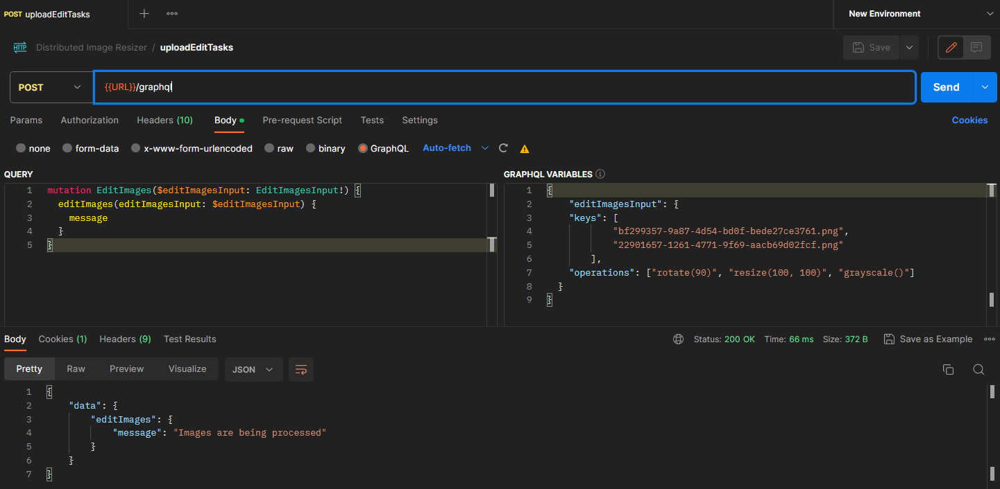
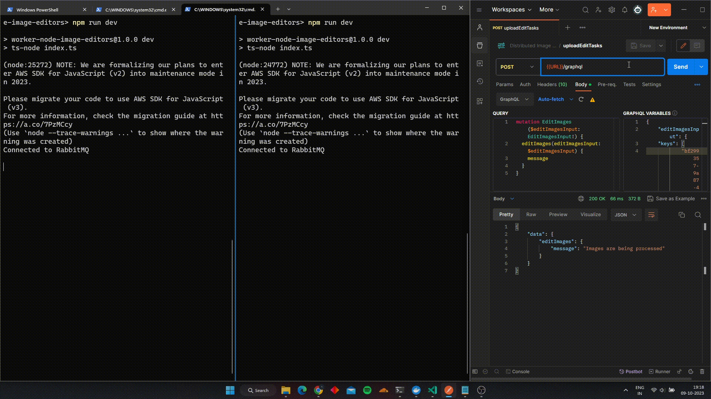

# Distributed Image Resizing System

A distributed image resizing system built using Express.js, GraphQL, MongoDB, React/Next.js, and RabbitMQ. This system allows users to submit image resizing tasks, which are then distributed to multiple worker nodes for parallel resizing.

## Architecture

The project follows a microservices architecture with the following components:

- **Backend**: Express.js server with GraphQL for managing the task queue and processing requests.
- **Message Broker**: RabbitMQ as the message broker for decoupling task distribution to worker nodes.
- **No SQL Database**: MongoDB as the database for storing task metadata and relationships.
- **Redis**: Redis as the in-memory database for caching frequently queried data and for maintaining user session.
- **Frontend**: React/Next.js application for submitting image resizing requests and tracking task progress.

## Getting Started
```bash
# Clone the repository
git clone https://github.com/RohitShah1706/Distributed-Image-Resizer-GraphQL-RabbitMQ-TS.git

# Enter into the directory
cd Distributed-Image-Resizer-GraphQL-RabbitMQ-TS

# Install the dependencies in of each directory
cd express-graphql-server
npm install

cd ../worker-node-image-editors
npm install

cd ../frontend
npm install
```

## Prerequisites
```bash
# Start the RabbitMQ server from the root of the project
PS D:\Projects\Distributed Image Processing> docker compose up -d rabbitmq
# Output should be something like this
[+] Running 2/2
 - Network distributedimageprocessing_default  Created              0.7s
 - Container rabbitmq                          Started              1.2s
```

## Running the backend server and worker node
```bash
# Start the backend graphql server
PS D:\Projects\Distributed Image Processing\express-graphql-server> cd express-graphql-server
PS D:\Projects\Distributed Image Processing\express-graphql-server> npm run dev

# Output should look something like this
Connected to Redis
Connected to MongoDB
Connected to RabbitMQ
Consuming images from worker node...
Server running at http://localhost:5000/graphql

# Start the worker node
cd worker-node-image-editors
npm run dev
```

## How it Works

1. User Interaction:
   - Users interact with the frontend interface by uploading an image and specifying resizing parameters.  

2. Image Resizing Request:
   - The frontend sends a request to the backend, containing the uploaded image and resizing parameters.
   - The backend receives the request and enqueues the image resizing task in RabbitMQ.

Example: We are submitting request to apply 3 operations on two images.



3. Task Distribution:
   - Worker nodes, independent processes, or services, continuously listen for tasks in the RabbitMQ queue.
   - Once a worker node detects a new task, it retrieves the message from RabbitMQ and starts processing the image resizing.

Example: The above request is split into 2 tasks and distributed to 2 worker nodes (multiple worker nodes can be used for parallel processing and to increase throughput).


4. Image Resizing Process:
   - The worker node utilizes the Sharp library to perform the required image resizing based on the received task details.
   - After completing the resizing process, the worker node can store the resized image in a designated location.

5. Task Completion Notification:
   - Upon finishing the resizing task, the worker node can send a completion or status update message to a separate messaging system or notification service.

6. Frontend Response:
   - The frontend, through polling or utilizing real-time technologies like WebSockets or server-sent events, listens for task completion notifications from the messaging system or notification service.
   - Once the frontend receives the completion notification, it can update the user interface to indicate that the image resizing process is complete.
   - The resized image can be displayed or made available for download to the user.

## Technologies Used

- [Express.js](https://expressjs.com) - Fast, unopinionated, minimalist web framework for Node.js.
- [GraphQL](https://graphql.org) - Query language for APIs to provide a flexible and efficient approach to data fetching.
- [MongoDB](https://mongodb.com/) - NoSQL database for storing and querying task metadata and relationships.
- [Redis](https://redis.io/) - In-memory database for caching frequently queried data and for maintaining user session.
- [React](https://reactjs.org) / [Next.js](https://nextjs.org) - JavaScript libraries for building user interfaces and server-rendered React applications.
- [RabbitMQ](https://www.rabbitmq.com) - Message broker for decoupling task distribution and enabling asynchronous communication.
- [Sharp](https://sharp.pixelplumbing.com/) - JavaScript image processing library for resizing images.


## Architeture Diagram
404 Not Found lol - working on it 😅